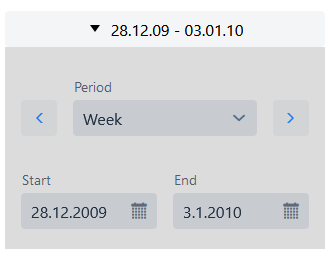
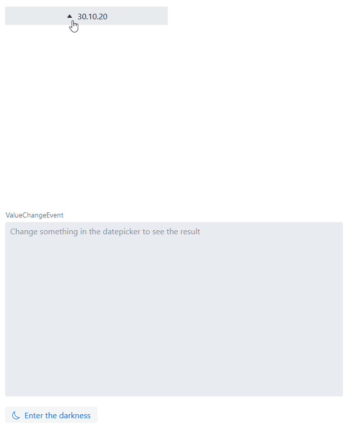

# vaadin-date-range-picker
A Vaadin Flow DateRangePicker implementation

## Installation
[Installation guide for the latest release](https://github.com/xdev-software/vaadin-date-range-picker/releases/latest#Installation)

#### Compatibility with Vaadin

| Vaadin version | DateRangePicker version |
| --- | --- |
| Vaadin 23+ (latest) | ``3+`` |
| Vaadin 14 (LTS - former release model) | ``2.x`` |

## Run the Demo
* Checkout the repo
* Run ``mvn clean install``
* Navigate into ``vaadin-date-range-picker-demo`` 
* Run ``mvn jetty:run``
* Open http://localhost:8080

  
Show example

  
  

## Releasing 
If the ``develop`` is ready for release, create a pull request to the ``master``-Branch and merge the changes

When the release is finished do the following:
* Merge the auto-generated PR (with the incremented version number) back into the ``develop``
* Add the release notes to the [GitHub release](https://github.com/xdev-software/vaadin-date-range-picker/releases/latest)
* Upload the generated release asset zip into the [Vaadin Directory](https://vaadin.com/directory) and update the component there

## Dependencies and Licenses
View the [license of the current project](LICENSE) or the [summary including all dependencies](https://xdev-software.github.io/vaadin-date-range-picker/dependencies/)
